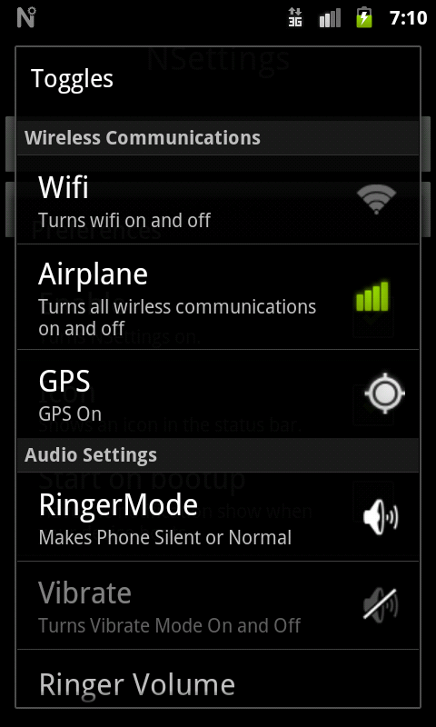

# NSettings

This is a Android application built originally for Gingerbread (2.3 API 10). It was an attempt to create a way to quickly manage system settings without having to navigate the horribly laid out (at the time) system settings app. This was accomplished by displaying a notification that when tapped would display a dialog with toggles and sliders to mange certain system settings.

## Developers

**This project requires API levels 8 and 10 to be installed**

Import the project into Android Studio to compile and run the project.

## License

[MIT](LICENSE.md)
